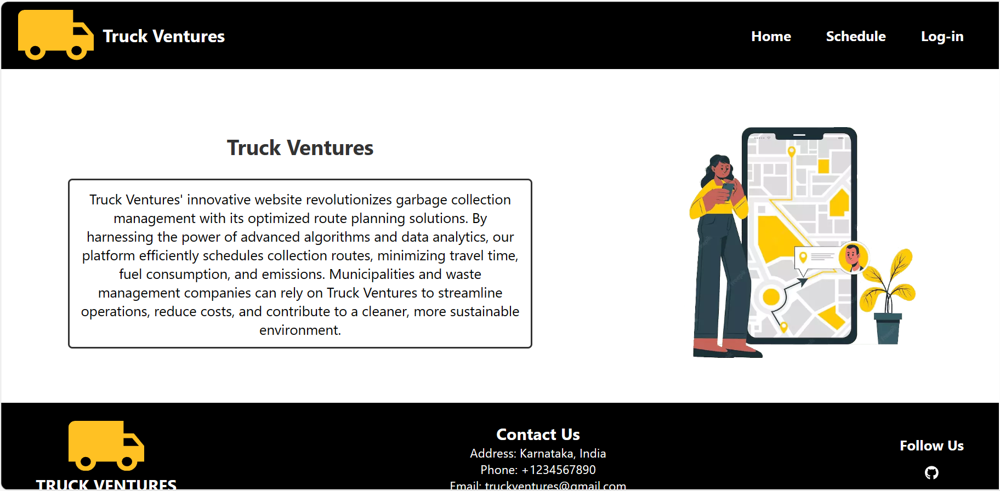
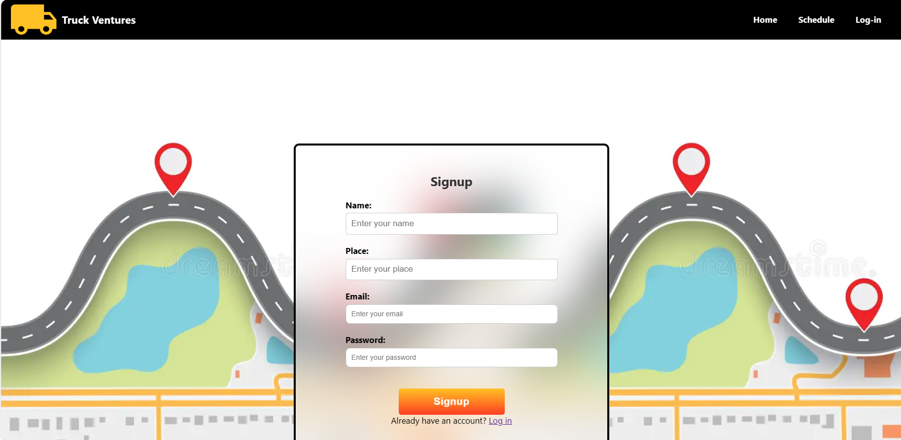
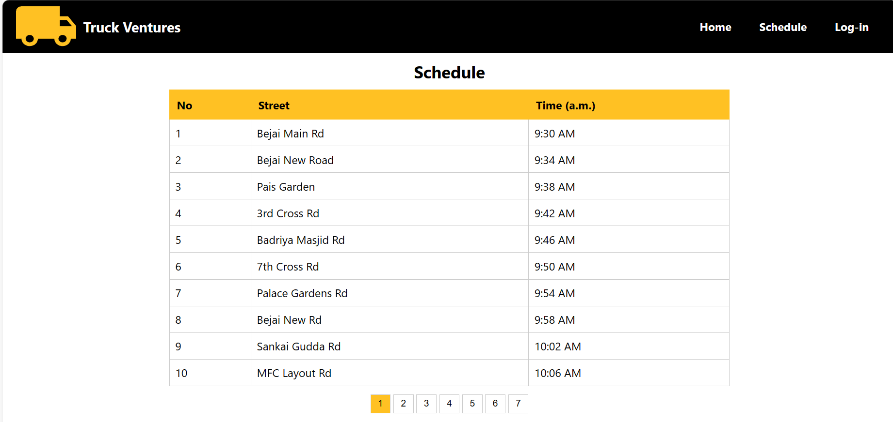
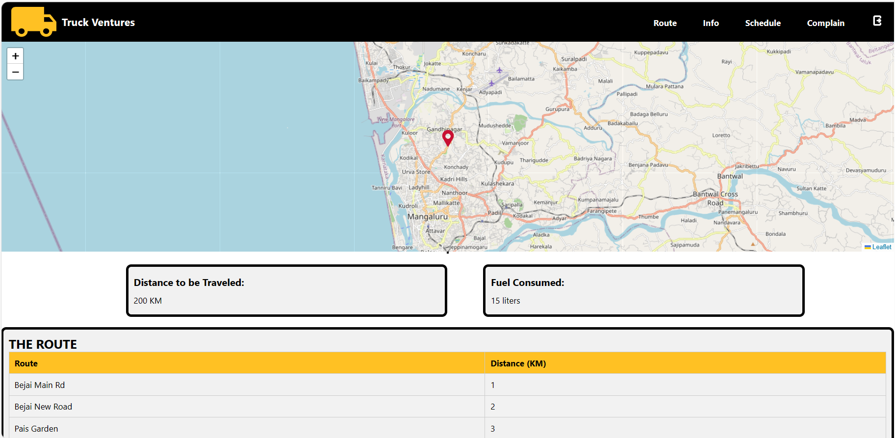
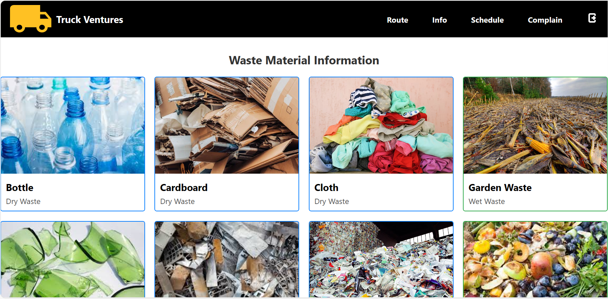
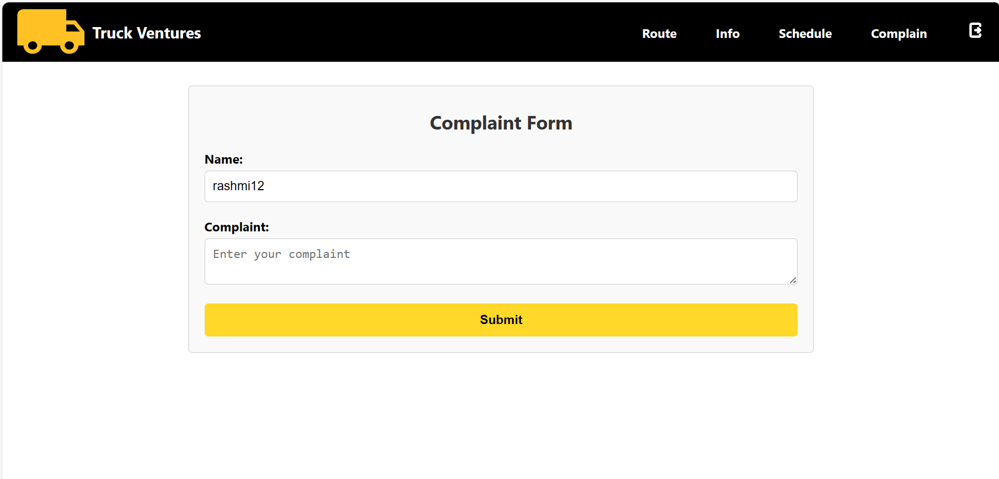

# TRUCK VENTURES

## Description

TRUCK VENTURES is a waste management system designed to optimize waste collection routes, manage complaints related to waste management, and provide information on wet and dry waste management. The system aims to improve the efficiency of waste collection processes, reduce fuel consumption, and minimize environmental impact.

## Dependencies

- **@fortawesome/free-brands-svg-icons**: v6.5.2
- **@fortawesome/react-fontawesome**: v0.2.0
- **@mdi/js**: v7.4.47
- **@mdi/react**: v1.6.1
- **@testing-library/jest-dom**: v5.17.0
- **@testing-library/react**: v13.4.0
- **@testing-library/user-event**: v13.5.0
- **cors**: v2.8.5
- **dotenv**: v16.4.5
- **emailjs-com**: v3.2.0
- **express**: v4.19.2
- **firebase**: v10.11.0
- **firebase-admin**: v12.1.0
- **js-cookie**: v3.0.5
- **leaflet**: v1.9.4
- **leaflet-routing-machine**: v3.2.12
- **mapbox-gl**: v3.2.0
- **mysql**: v2.18.1
- **react**: v18.2.0
- **react-dom**: v18.2.0
- **react-leaflet**: v4.2.1
- **react-router-dom**: v6.23.0
- **react-scripts**: v5.0.1
- **web-vitals**: v2.1.4

## Installation

1. Clone the repository.
2. Navigate to the project directory.
3. Run `npm install` to install dependencies.
4. Set up environment variables if necessary.

## Usage

This project serves the following purposes:

- **Schedule**: Displays the optimized schedule for waste collection.
- **Complain**: Allows users to submit complaints related to waste management.
- **Info**: Provides information on wet and dry waste management.
- **Route**: Displays a map and the optimized route for waste collection.

## Page Images

### Home Page

### Login Page

### Signup Page

### Forgot Password Page

### Schedule Page

### Route Page

### Info Page

### Complain Page

## Contact

For any inquiries or suggestions, please reach out to [Rashmi N](https://github.com/nrashmi06).
